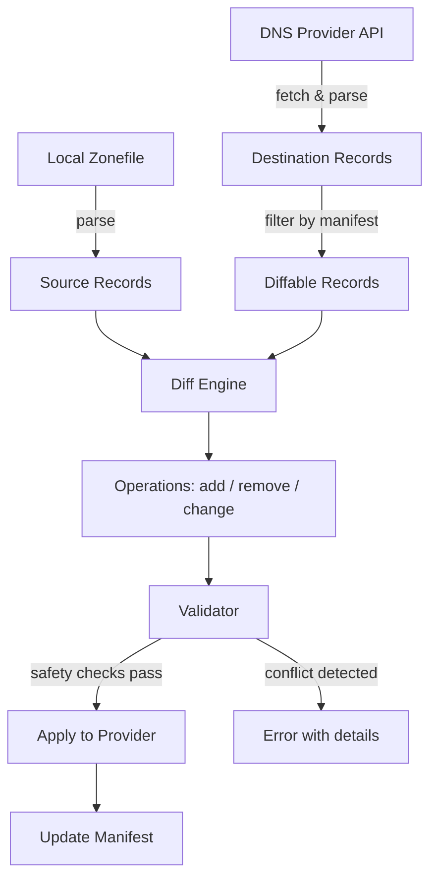
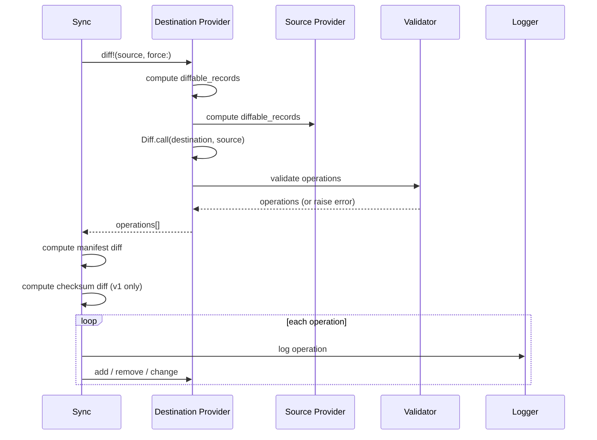
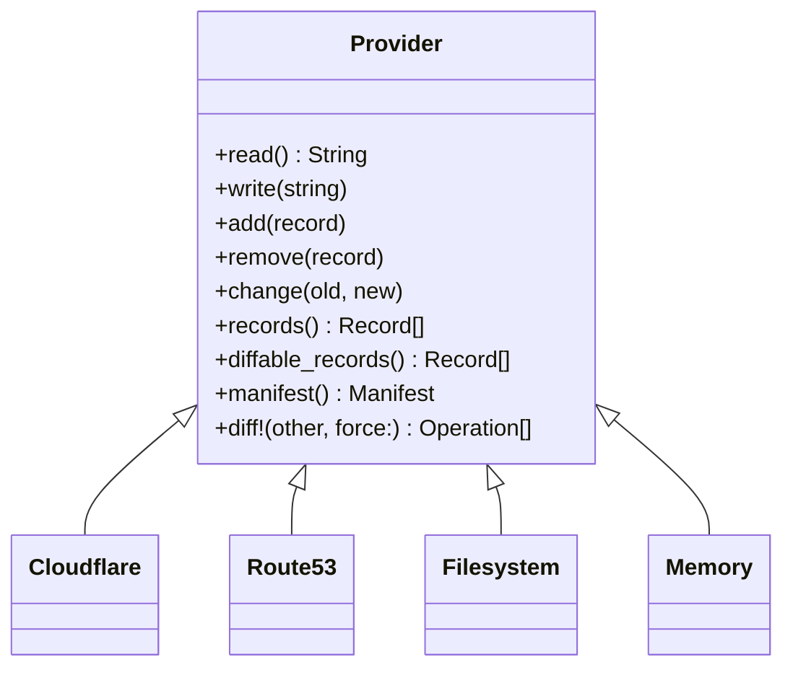

# Architecture: Zonesync

Zonesync synchronizes DNS zone files with DNS providers (Cloudflare, Route53). It treats DNS configuration as code — you edit a local Zonefile, and zonesync pushes the changes to your DNS provider, tracking what it manages via a manifest record.

## Sync Data Flow



## Entry Points

Three ways to invoke zonesync:

| Entry Point | File | Usage |
|---|---|---|
| CLI | `exe/zonesync` via `CLI` | `zonesync [sync\|generate\|repair]` |
| Rake | `lib/zonesync/rake.rb` | `rake zonesync` |
| Ruby API | `lib/zonesync.rb` | `Zonesync.call(source:, destination:)` |

The main module (`lib/zonesync.rb`) provides three class methods — `call`, `generate`, and `repair` — each constructing a `Sync`, `Generate`, or `Repair` instance from provider configuration and invoking it.

Provider configuration comes from Rails encrypted credentials (`config/credentials.yml.enc`), keyed by the source/destination identifiers passed through the CLI or API.

## Orchestration Layer

### Sync (`lib/zonesync/sync.rb`)

The core operation. Given a source and destination provider:



### Generate (`lib/zonesync/generate.rb`)

Pulls the current zone from a DNS provider and writes it as a local Zonefile. One line: `destination.write(source.read)`.

### Repair (`lib/zonesync/repair.rb`)

Interactive mode for resolving drift between local and remote. Computes a raw diff (ignoring manifest filtering), then walks the user through each difference:

- **Remote only:** adopt into Zonefile, delete from provider, or ignore
- **Local only:** push to provider, remove from Zonefile, or ignore
- **Changed:** pick local version, pick remote version, or ignore

After confirmation, applies all chosen actions and updates the manifest.

## Provider Pattern

All DNS sources implement the same interface defined in `Provider` (`lib/zonesync/provider.rb`):



| Provider | Backend | Auth | Notes |
|---|---|---|---|
| **Cloudflare** | Cloudflare DNS API (JSON) | Token or email+key | Supports proxy toggle via `cf_tags` in comments |
| **Route53** | AWS Route53 API (XML) | Access key + secret | AWS Sig V4 signing; handles multi-value record sets |
| **Filesystem** | Local file | None | Reads/writes Zonefile at a configured path |
| **Memory** | In-memory string | None | Used in tests |

The base class provides `diff!` and `diffable_records` — providers only need to implement `read`/`write` and optionally override `add`/`remove`/`change` for API-specific behavior.

### Cloudflare Specifics

- Synthesizes a fake SOA record (Cloudflare API doesn't expose one)
- Handles MX priority by splitting it from rdata
- `ProxiedSupport` module extends records with proxy toggle tracking via `cf_tags=cf-proxied:true/false` in the comment field
- Detects duplicates via API error code 81058

### Route53 Specifics

- Records are grouped into "record sets" (same name+type) — Route53 treats these atomically
- Removing one record from a multi-value set requires deleting the whole set and recreating the remainder
- TXT records split at the 255-character boundary per RFC
- All requests signed with AWS Signature Version 4

## Data Model

### Record (`lib/zonesync/record.rb`)

Immutable struct: `name`, `type`, `ttl`, `rdata`, `comment`.

Key behaviors:
- `identical_to?` — exact match on all four data fields (ignoring comment)
- `conflicts_with?` — same name+type where only one record is allowed (CNAME, SOA) or same MX priority
- `manifest?` / `checksum?` — identifies zonesync meta-records
- Sorting: SOA first, then alphabetical by type/name/rdata/ttl

### Zonefile (`lib/zonesync/zonefile.rb`)

Parses RFC-compliant zone file strings into `Record` arrays. Uses a Treetop PEG grammar (`zonefile.treetop`) via the `Parser` module. Injects a dummy SOA if the zone string lacks one (needed for provider-sourced zones).

### Parser (`lib/zonesync/parser.rb`)

Wraps the Treetop grammar. The `Zone` class processes `$ORIGIN` and `$TTL` variables, qualifies relative hostnames, and tracks implicit name inheritance (when a record line omits the name, it inherits from the previous record).

## Safety Layer

### Manifest (`lib/zonesync/manifest.rb`)

A special TXT record (`zonesync_manifest`) that tracks which records zonesync manages, distinguishing them from manually-created records.

**V1 format:** `"A:@,mail;CNAME:www;MX:@ 10,@ 20"` — type-grouped shorthand names.

**V2 format:** `"1r81el0,60oib3,ky0g92"` — comma-separated per-record hashes (via `RecordHash`).

The manifest determines the set of "diffable" records — only managed records participate in the diff. Unmanaged records are left alone.

### Validator (`lib/zonesync/validator.rb`)

Runs before operations are applied. Checks (skipped with `--force`):

1. **Missing manifest** — first sync must explicitly add the manifest record
2. **Checksum mismatch** (v1) — detects external changes to managed records
3. **Manifest integrity** (v2) — verifies each expected record hash exists on the remote
4. **Conflict detection** — prevents overwriting untracked records that share a name+type with a new record

### RecordHash (`lib/zonesync/record_hash.rb`)

Generates a 6-character base36 hash (CRC32) of `"name:type:ttl:rdata"` for v2 manifest entries. Enables per-record integrity checking.

## Supporting Infrastructure

### HTTP (`lib/zonesync/http.rb`)

Thin wrapper around `Net::HTTP` with `get`/`post`/`patch`/`delete`. Supports `before_request` and `after_response` hooks — used by Route53 for request signing and by Cloudflare for auth headers. Raises on non-2xx responses.

### Logger (`lib/zonesync/logger.rb`)

Logs each operation (add/remove/change) to STDOUT and optionally to `log/zonesync.log`.

### Errors (`lib/zonesync/errors.rb`)

| Error | When |
|---|---|
| `ConflictError` | Untracked record would be overwritten |
| `ChecksumMismatchError` | External changes detected (v1 or v2) |
| `MissingManifestError` | No manifest on first sync |
| `DuplicateRecordError` | Provider reports record already exists |

## File Map

```
lib/zonesync/
  cli.rb              # Thor CLI commands
  rake.rb             # Rake task definition
  sync.rb             # Sync orchestration
  generate.rb         # Zone generation
  repair.rb           # Interactive repair
  provider.rb         # Base provider + Filesystem + Memory
  cloudflare.rb       # Cloudflare provider
  cloudflare/
    proxied_support.rb # Cloudflare proxy toggle handling
  route53.rb          # Route53 provider
  record.rb           # DNS record struct
  zonefile.rb         # Zone file loader
  parser.rb           # Treetop grammar wrapper
  zonefile.treetop    # PEG grammar for RFC 1035 zone files
  diff.rb             # Diff engine
  manifest.rb         # Manifest tracking (v1 + v2)
  validator.rb        # Pre-sync safety checks
  record_hash.rb      # Per-record CRC32 hashing
  http.rb             # HTTP client with hooks
  logger.rb           # Operation logging
  errors.rb           # Custom exception classes
  version.rb          # Gem version constant
```
